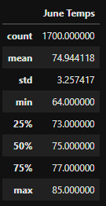
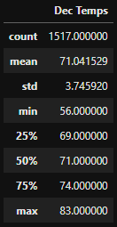
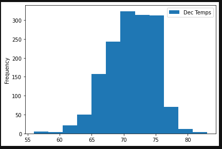
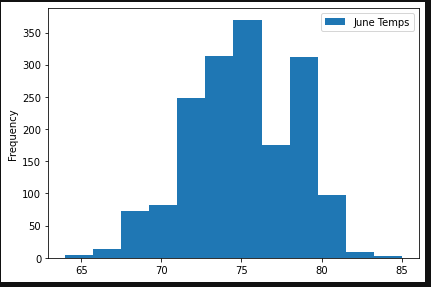

# Surf's Up Challenge

## Project Overview
Analysis of temperature data for June and December in Oahu to determine if W.Avy's business will be sustainable year-round.

## Results

 1. The average temperatures for June and December are fairly close, with June's average at 75F and December's average at 71F.

 2. The minimum temperature for June is 64F, whereas the minimum temperature for December is much lower at 56F.

 3. The maximum temperatures for both June and December are fairly close, with June's max at 85F and December's max at 83F.

 ## Summary
Based on the analysis, it appears that both June and December have good enough weather for W.Avy's business to be sustainable year-round. However, he should take into consideration that since temperatures in December can drop as low as 56F, there may be some days in December where business will be slow. 

One way to address this is to look create a histogram of the December temperatures and see if low temperatures occur frequently enough to cause issues for W.Avy's business. 

When looking at the histogram, it's clear that the temperature is typically in the 70s, and temperatures below 65F are quite rare. This suggests December won't have many days where low temps will affect business. 

Using the same method to further evaluate the June Temperatures, we can see weather in June is most frequently between 70-80F, which is good for business. 